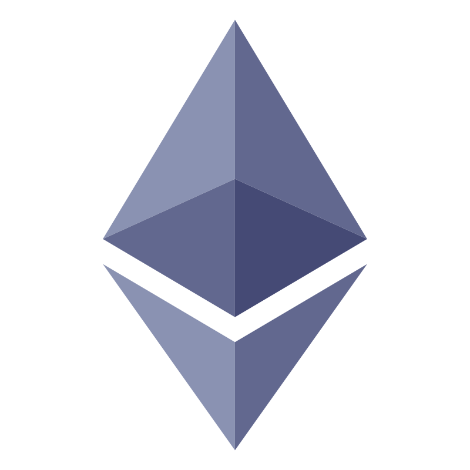

<h1 align="center">
  <br/>
  HelpifyMe - Crowd funding Dapp
  <br/>
<br/>
</h1>

<p align="center">
    
    
    
    
       
    
    
    
    
    
</p>

<h3 align="center"><a target="_blank" href="https://helpify-me.vercel.app/"><strong>Want to see live preview »</strong></a></h3>

<p align="center"> 
    <br />&#10023;
    <a href="#Getting-Started">Getting Started</a> &#10023; 
    <a href="#Install">Installation</a> &#10023;    
    <a href="#Author">Author</a> &#10023;
  </p>

Helpify-Me is an ethereum based dapp where we can contribute the currency (ether) to the funds that are created by any person for mainly medical emergency.

The application is deployed to the rinkeby test network.

## Getting Started

This project was built using React, Material-UI, Ethers.js, Infura, Solidity, Truffle, Ganache and Ethereum Blockchain. It is an e-commerce web application and for running on your local environment you should follow these guidelines.

### Prerequisites

- NPM
- Node JS
- Metamask Browser Extension
- Infura API Key
- Ganache
- Truffle

### Setup

The project repository can be found in [GitHub link](https://github.com/SumanChakraborty1998/helpify-me-crowdfund) or just clone the project using this command.

```
Using HTTPS

# git clone  https://github.com/SumanChakraborty1998/helpify-me-crowdfund.git
```

- Open terminal on your workspace with

```
cd /home/workspace/helpify-me-crowdfund
```

## Install

Install NPM

Check that you have node and npm installed

To check if you have Node.js installed, run this command in your terminal:

```
node -v
```

To confirm that you have npm installed you can run this command in your terminal:

```
npm -v
```

To install all the dependences of the project, run the following command:

```
cd client

npm install

cd ../

npm install
```

To run the application got to the client folder and run the following command:

```
cd client

npm start
```

### Environment Variables

To run this project, you will need to add the following environment variables to your .env file in root folder

`RINKEBY_URL`

`PRIVATE_KEY`

You will need to add the following environment variables to your .env file in client folder

`REACT_APP_IMGUR_CLIENT_ID`

`REACT_APP_CONTRACT_ADDRESS`

## Working Procedure

1. In the landing page, user need to login with their Metamask (https://metamask.io/) wallet.
2. Keep some test ethers (rinkeby) in to that particular wallet.
3. If there are any raised-fund exist, it will be displayed.
4. You can create your own fund for any particular emergency.
5. You can also contribute in the existing funds.
6. For contributing, you should contribute minimum the amount that is set by the seeker of that fund.

## Author

If you want to contact me, you can reach me through below handles.

[ ](https://www.linkedin.com/in/suman-chakraborty-699308120/)
[](https://github.com/SumanChakraborty1998/)

© 2022 Suman Chakraborty

## Show your support

Give a ⭐️ if you like this project!
